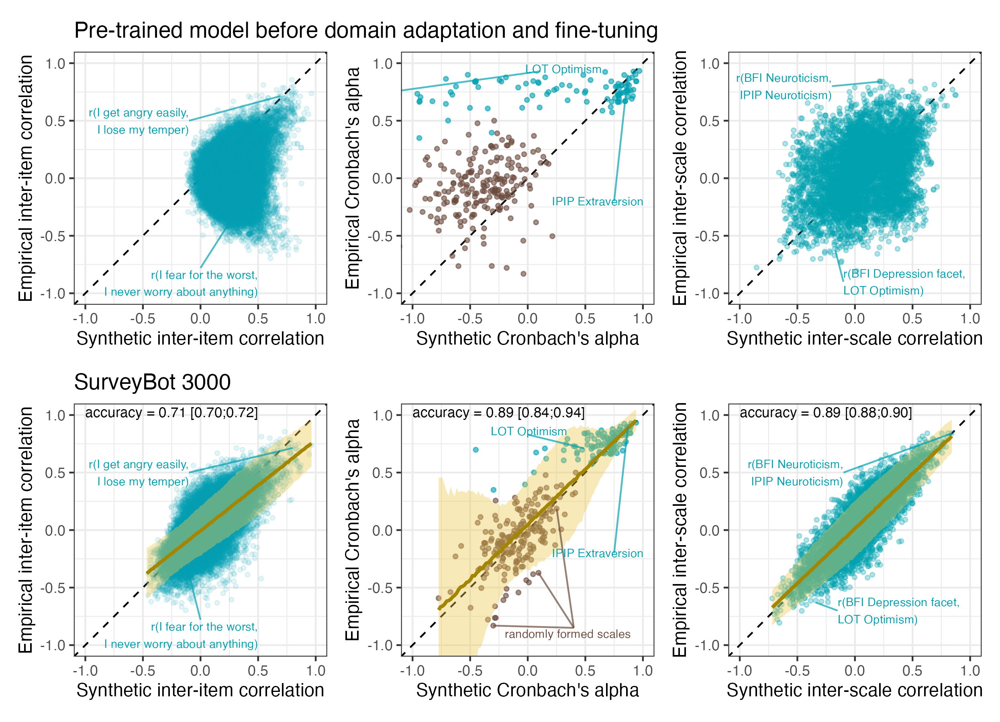
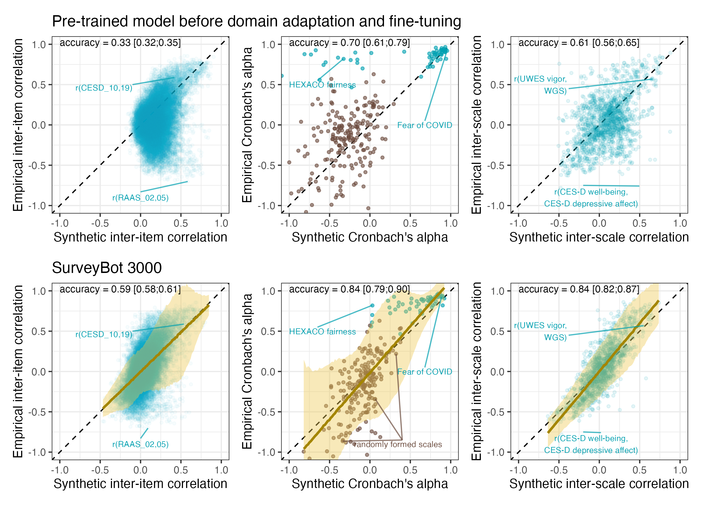

## Table of contents

### Pilot Study
- [Import and prepare data](1_vector_to_cosine.html)
- [Pilot Study Results](validation_study.html)
  - [Interactive Item Plot](2_interactive_item_plot.html)

### Registered Report Stage 1
- [Registered Report Precision Simulations](3_rr_precision_simulations.html)
 
### Registered Report Stage 2: Validation Study
- [Import and prepare data](1_import_validation_study.html)
- [Codebook](codebook.html)
  - [Data in CSV format](rr_data.csv)
  - [Data in SAV format](rr_data.sav)
  - [Data in RDS format](rr_data.rds)
- [Validation Study Results](validation_study.html)
  - [Interactive Item Plot (Registered Report)](2_interactive_item_plot_rr.html)
  - [Margin of error comparison](se_sample_size.html)

